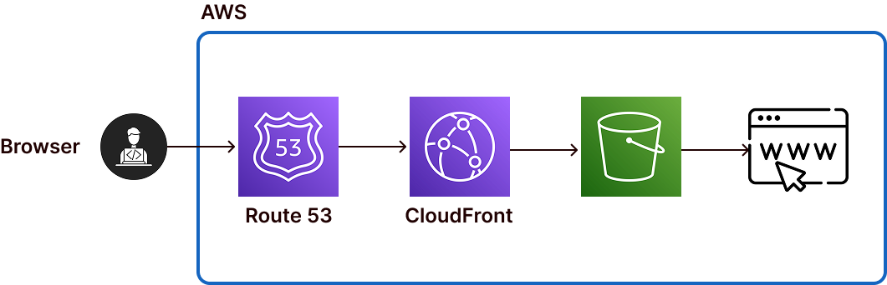
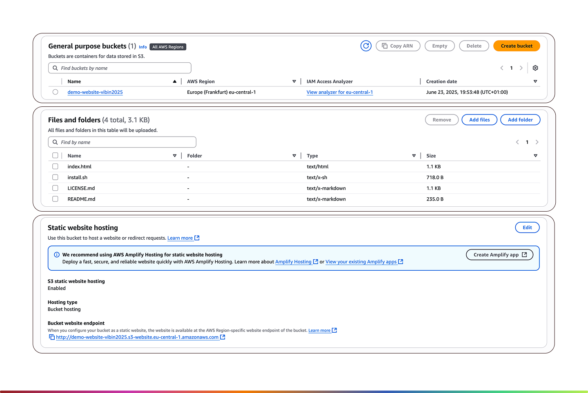

# Hosting a Static Website on Amazon S3 with Secure Access
Hosting a Static Website on Amazon S3 with Secure Access

#### Problem Statement
Nowadays increasing the demand of cost-effective, highly available, and globally accessible websites.  

Traditional web hosting: involved complex process like manage server configure softwares. it leads to high operational overhead making them unsuitable for projects with limited resources or scalability requirements.  

Amazon S3: offers a server-less, scalable alternative that enables users to host static websites with minimal configuration.  

When we need this use case:  
- Hosting Static Websites
- Scalable and Cost-Effective
- Global Content Delivery
- Security with Simple Access Control

Advantages:  
- Availability and Durability
- Scalability 5TB
- Security
- Cost Effective
- Performance




Step 1  
I have created a s3.

Step 2  
Add files in the bucket inside s3.

Step 3  
Add Static website hosting (Properties)



Step 4  
Edit permmision and provide policy 

```
{
    "Version": "2012-10-17",
    "Statement": [
        {
            "Sid": "Statement1",
            "Effect": "Allow",
            "Principal": "*",
            "Action": "s3:GetObject",
            "Resource": "arn:aws:s3:::demo-website-vibin/*"
        }
    ]
}
```
create iam policy
Cloudfront - Content Delivery Network (CDN) 
CloudFront caches that content at edge locations (data centers) around the world
